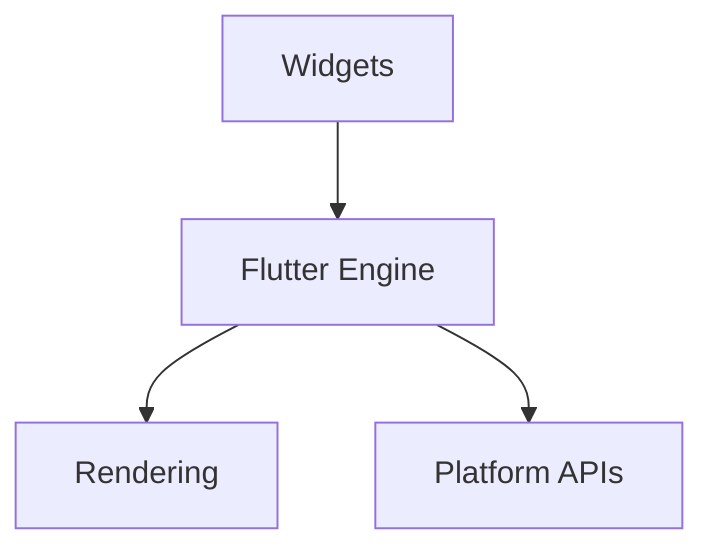

**Table of contents**

<Toc maxDepth="2"/>

---
layout: image
image: https://static.vecteezy.com/system/resources/previews/032/947/577/non_2x/technology-meets-nature-with-smart-phone-free-photo.jpg
backgroundSize: cover
---

# Cross-Platform Mobile Application Development

## Flutter Track — Lecture Slides 2026

---

## Course at a Glance
- 10 sessions, foundations-first
- Flutter + Dart only
- Build a production-ready learning diary
- Evaluation focuses on technical implementation

---

## Course Introduction (Online Students)
This is a fully online course with live sessions and independent work.

**Lecture time (all sessions):** 17:15 - 19:45 (Zoom)

---

## Session Dates (Zoom)
| Date | Time |
|---|---|
| 15.01.2026 | 17:15 - 19:45 |
| 19.01.2026 | 17:15 - 19:45 |
| 28.01.2026 | 17:15 - 19:45 |
| 12.02.2026 | 17:15 - 19:45 |
| 24.03.2026 | 17:15 - 19:45 |
| 01.04.2026 | 17:15 - 19:45 |
| 09.04.2026 | 17:15 - 19:45 |
| 15.04.2026 | 17:15 - 19:45 |
| 22.04.2026 | 17:15 - 19:45 |
| 06.05.2026 | 17:15 - 19:45 |

---

## How Online Sessions Work
- Live lecture + live coding + Q&A
- Recordings and materials posted after each session
- Weekly diary updates are required
- Ask questions in Zoom or course channel

---

## Expected Weekly Routine
1. Attend the live session (or watch the recording)
2. Complete the lecture task
3. Update the learning diary checklist for that lecture
4. Push app progress forward (small, consistent steps)

---

## Why Each Lecture Matters
| Lecture | Benefit to You |
|---|---|
| L1 Foundations | Understand trade-offs and choose tools wisely |
| L2 Setup | Build a reliable dev environment like real teams |
| L3 Dart Basics | Read, debug, and extend Flutter code safely |
| L4 Widgets + State | Build interactive UI and manage changes |
| L5 Async + HTTP | Connect real APIs without breaking the UI |
| L6 Architecture | Keep code maintainable as features grow |
| L7 Testing | Prove your code works and avoid regressions |
| L8 Platform + Deployment | Handle real device differences and release |
| L9 Workshop | Debug and polish like a real project |
| L10 Wrap-Up | Reflect and prepare for future improvements |

---

## Lecture 1 — Course Basics + Cross-Platform Fundamentals

### Goals
- Understand what cross-platform means
- Compare native vs cross-platform
- Know what Flutter is and why it matters

---

### Lecture 1 Agenda
- Course structure and expectations
- Assessment and learning diary requirements
- Cross-platform fundamentals
- Flutter overview

---

### We Start Building in Lecture 1
- Create the Flutter project together
- Run the app on emulator/device
- Make first small UI change
- Dart basics introduced as needed while coding

---

### Course Introduction (Lecture 1)
- This course is **online-first** with live sessions and recordings
- The focus is **Flutter + Dart** from zero
- You will build a real app and document the process

---

### Communication and Support
- Ask questions during Zoom or via course channel
- Post blockers early (setup, emulator, API keys)
- Weekly progress updates in the learning diary

---

### How You Are Evaluated (Simple Summary)
- **Lecture deliverables** (L1-L10) = required
- **Working app** with core features = required
- **Testing evidence** and **platform-specific notes** = required
- Writing style is **bonus**, not the main scoring factor

---

### What You Deliver by the End
- A working Flutter app
- A learning diary that includes:
  - All lecture checklists
  - Required screenshots with explanations
  - Evidence of testing and data flow

---

### Course Requirements (What You Must Deliver)
- Working Flutter app with key features
- Learning diary with lecture checklists and screenshots
- Evidence of testing and platform-specific considerations

---

### Git Requirement (All Students)
- Push your code to a Git repository during the course
- Your repo is proof of continuous progress
- You may keep the learning diary as `learning-diary.md` in the repo

---

### Example App (Required Features)
Any app idea is allowed, but it must include:
- Two meaningful screens
- Remote data (API or database)
- State management (Provider or equivalent)
- Visible loading and error states
- User input (search/form/selection)
- Platform-specific element
- Unit test + widget test evidence

---

### Assessment Overview (Technical Focus)
- Lecture deliverables (L1-L10) are graded
- App functionality and architecture matter most
- Writing quality is a bonus, not the main factor

---

### AI Policy (Short Version)
- If you use AI, describe **how** and **which model(s)**
- This affects grading (clarity and honesty matters)
- Mandatory diary question: "Did you use AI and if you did, how?"

---

### Why This Matters
- Helps you choose the right tool for the right problem
- Explains the trade-offs you will defend in interviews and design docs
- Sets context for every technical choice in the rest of the course

---

### Cross-Platform in One Slide
| Approach | Pros | Cons |
|---|---|---|
| Native | Best performance, full platform APIs | Separate codebases |
| Cross-platform | Single codebase, faster iteration | Some platform limits |

---

### Frameworks That Target iOS + Android From One Codebase
- Flutter (Dart)
- React Native (JavaScript/TypeScript)
- .NET MAUI (C#)
- Kotlin Multiplatform Mobile (Kotlin)
- Ionic + Capacitor (Web technologies)
- NativeScript (JavaScript/TypeScript)
- Xamarin (C#) — legacy, replaced by MAUI
- Qt (C++/QML)
- Unity (C#) — common for games

---

### Flutter Architecture (High-Level)


---

### Key Vocabulary
- **Widget:** UI building block
- **State:** Data that changes the UI
- **Hot reload:** Fast UI iteration
- **Build method:** UI description function

---

### First Task (In Diary)
1. Define cross-platform development in your own words
2. List known frameworks
3. Self-assess web and OOP knowledge

---

### Learning Diary Checklist (Lecture 1)
- Your definition of cross-platform development
- Short comparison: native vs cross-platform (2-3 sentences each)
- Why Flutter? (based on this course's goals)
- Personal learning goals for the course (3-5 bullet points)

---

## Lecture 2 — Tooling and Environment Setup

### Goals
- Install Flutter and dependencies
- Run your first Flutter app
- Verify device/emulator setup

---

### Why This Matters
- A stable environment prevents wasted time and hidden bugs
- Teams expect you to diagnose setup issues independently
- Reproducible setup is required for collaboration

---

### Setup Checklist
1. Install Flutter SDK
2. Install Android Studio and emulator
3. Add Flutter to PATH
4. Run `flutter doctor -v`

---

### `flutter doctor` Example
```bash
flutter doctor -v
```

**Expected:** no red errors  
**Screenshot required** for learning diary

---

### First Flutter App
```bash
flutter create hello_flutter
cd hello_flutter
flutter run
```

---

### Learning Diary Checklist (Lecture 2)
- Step-by-step setup summary (Flutter SDK + Android Studio)
- `flutter doctor -v` screenshot and what you fixed (if any)
- Emulator/device screenshot running the starter app
- One setup issue you faced and how you solved it

---

## Lecture 3 — Dart Basics (From Zero)

### Goals
- Understand Dart syntax
- Work with types, lists, maps
- Write functions and classes

---

### Why This Matters
- Dart is the language of Flutter, so you must read and debug it
- Types and null safety reduce runtime crashes
- Functions and classes are the building blocks for features

---

### Variables and Types
```dart
void main() {
  final name = 'Taylor';
  int age = 20;
  double gpa = 4.0;
  bool isStudent = true;
  print('$name $age $gpa $isStudent');
}
```

---

### Lists and Maps
```dart
final movies = ['Dune', 'Arrival'];
final ratings = {'Dune': 5, 'Arrival': 4};

void main() {
  movies.add('Interstellar');
  print(ratings['Dune']);
}
```

---

### Functions and Classes
```dart
class User {
  final String name;
  User(this.name);
}

String greet(User user) => 'Hello, ${user.name}';
```

---

### Task (Diary)
- Write a CLI app with functions, lists, and maps
- Explain variables, types, and control flow

---

### Learning Diary Checklist (Lecture 3)
- CLI app code snippet (functions, list, map)
- Explanation of `final` vs `var`, and null safety
- Example of a class and how you used it
- Screenshot or output of your CLI app

---

## Lecture 4 — Flutter Widgets + State Basics

### Goals
- Understand widget tree
- Build a simple interactive app
- Learn Stateful vs Stateless

---

### Why This Matters
- Widgets are Flutter’s core abstraction for UI
- State is what makes an app interactive
- Knowing the widget tree helps you debug layout issues quickly

---

### Stateless vs Stateful
```dart
class TitleText extends StatelessWidget {
  const TitleText({super.key});

  @override
  Widget build(BuildContext context) {
    return const Text('Hello Flutter');
  }
}
```

---

### Counter (Stateful)
```dart
class CounterPage extends StatefulWidget {
  const CounterPage({super.key});
  @override
  State<CounterPage> createState() => _CounterPageState();
}

class _CounterPageState extends State<CounterPage> {
  int count = 0;
  @override
  Widget build(BuildContext context) {
    return Scaffold(
      appBar: AppBar(title: const Text('Counter')),
      body: Center(child: Text('Count: $count')),
      floatingActionButton: FloatingActionButton(
        onPressed: () => setState(() => count++),
        child: const Icon(Icons.add),
      ),
    );
  }
}
```

---

### UI Basics
- `Column`, `Row`, `Container`
- Padding and alignment
- Material vs Cupertino widgets

---

### Learning Diary Checklist (Lecture 4)
- Screenshot of your counter app
- Explanation of widget tree in your app (top 3-5 widgets)
- Difference between Stateless and Stateful (in your own words)
- What `setState` does and when you used it

---

## Lecture 5 — Async and HTTP

### Goals
- Understand `async` and `await`
- Fetch data from API
- Handle errors and loading states

---

### Why This Matters
- Real apps depend on network data
- Async patterns prevent UI freezes and crashes
- Error handling protects user experience

---

### Async/Await
```dart
Future<String> fetchData() async {
  await Future.delayed(const Duration(seconds: 1));
  return 'Loaded';
}
```

---

### HTTP Fetch (TMDB)
```dart
import 'dart:convert';
import 'package:http/http.dart' as http;

Future<List<dynamic>> fetchMovies(String apiKey) async {
  final url = Uri.parse(
    'https://api.themoviedb.org/3/movie/popular?api_key=$apiKey',
  );
  final response = await http.get(url);
  if (response.statusCode != 200) {
    throw Exception('Failed to load movies');
  }
  final data = jsonDecode(response.body) as Map<String, dynamic>;
  return data['results'] as List<dynamic>;
}
```

---

### Task (Diary)
- Fetch API data and render list
- Add error handling
- Screenshot of API integration

---

### Learning Diary Checklist (Lecture 5)
- Short explanation of `async`/`await` and Future
- API request code snippet (URL, headers if used)
- Screenshot of loaded list + loading state
- Error handling example (what happens when API fails)

---

## Lecture 6 — Architecture + State Management

### Goals
- Separate UI from logic
- Introduce Provider
- Understand data flow

---

### Why This Matters
- Good structure makes features easier to add
- Clear data flow reduces bugs and confusion
- State management is required for non-trivial apps

---

### Folder Structure (Example)
```
lib/
  models/
  services/
  providers/
  screens/
  widgets/
```

---

### Provider Example
```dart
class MoviesProvider with ChangeNotifier {
  final List<dynamic> _movies = [];
  bool _loading = false;

  List<dynamic> get movies => _movies;
  bool get loading => _loading;

  Future<void> loadMovies(String apiKey) async {
    _loading = true;
    notifyListeners();
    try {
      final results = await fetchMovies(apiKey);
      _movies
        ..clear()
        ..addAll(results);
    } finally {
      _loading = false;
      notifyListeners();
    }
  }
}
```

---

### Task (Diary)
- Explain state ownership
- Show data flow (diagram or explanation)
- Screenshot of provider usage in UI

---

### Learning Diary Checklist (Lecture 6)
- App folder structure screenshot or tree
- Provider class snippet + explanation
- Data flow explanation (service -> provider -> UI)
- One design decision and why you made it

---

## Lecture 7 — Testing

### Goals
- Write unit tests
- Write widget tests
- Report results

---

### Why This Matters
- Tests catch regressions early
- You can refactor with confidence
- Testing is a standard requirement in professional teams

---

### Unit Test
```dart
import 'package:flutter_test/flutter_test.dart';

int add(int a, int b) => a + b;

void main() {
  test('add returns correct sum', () {
    expect(add(2, 3), 5);
  });
}
```

---

### Widget Test
```dart
import 'package:flutter_test/flutter_test.dart';
import 'package:my_app/main.dart';

void main() {
  testWidgets('counter increments', (tester) async {
    await tester.pumpWidget(const MyApp());
    expect(find.text('0'), findsOneWidget);
  });
}
```

---

### Task (Diary)
- Add 1 unit test and 1 widget test
- Include results screenshot

---

### Learning Diary Checklist (Lecture 7)
- Test file locations and names
- Unit test: what it covers and why
- Widget test: what it covers and why
- Screenshot of test results

---

## Lecture 8 — Platform-Specific + Deployment

### Goals
- Implement platform-specific UI
- Understand deployment basics

---

### Why This Matters
- Users expect platform-native behavior
- You must ship real builds, not just demos
- Platform differences often break otherwise working apps

---

### Platform-Specific Widget
```dart
import 'dart:io' show Platform;
import 'package:flutter/cupertino.dart';
import 'package:flutter/material.dart';

Widget platformButton(VoidCallback onPressed) {
  return Platform.isIOS
      ? CupertinoButton(child: const Text('OK'), onPressed: onPressed)
      : ElevatedButton(onPressed: onPressed, child: const Text('OK'));
}
```

---

### Deployment Basics
- Build Android APK: `flutter build apk`
- Build iOS (macOS required): `flutter build ios`

---

### Learning Diary Checklist (Lecture 8)
- Platform-specific code snippet and explanation
- Why this feature is platform-specific
- Build command used and output screenshot (APK or iOS)
- Note any platform limitation you observed

---

## Lecture 9 — Workshop

### Goals
- Debug and polish app
- Improve performance and UX
- Review diary progress

---

### Why This Matters
- Most real work is fixing and polishing, not only building
- Debugging skills separate juniors from mid-level developers
- Documentation quality affects how your work is evaluated

---

### Workshop Checklist
- No red errors in `flutter doctor`
- API data loads correctly
- Error states shown
- Tests pass

---

### Learning Diary Checklist (Lecture 9)
- Bug list with fixes (at least 2)
- Before/after screenshots for one fix
- Performance or UX improvement (1 example)
- Remaining known issues

---

## Lecture 10 — Wrap-Up

### Goals
- Final submissions
- Rubric overview
- Q&A

---

### Why This Matters
- Reflection helps you retain what you learned
- Final delivery quality impacts evaluation
- Clear documentation increases the value of your portfolio

---

### Learning Diary Checklist (Lecture 10)
- Final feature list (bullet list)
- Self-evaluation against rubric (brief)
- What you would improve next
- Final submission checklist (screenshots included)

---

## Learning Diary Reminders
- All lecture checklists (L1-L10) completed
- Required screenshots
- Technical explanations for each screenshot
- AI usage described (model names + how it was used)
- Answer: "Did you use AI and if you did, how?"

---

## Thank You
Questions?
